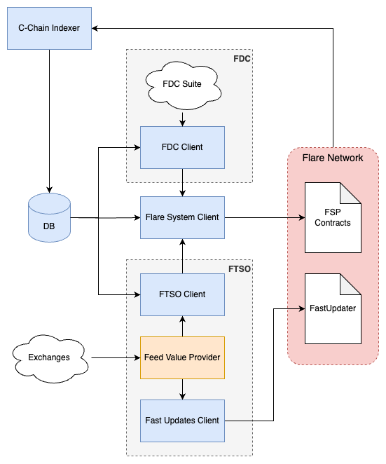

<p align="left">
  <a href="https://flare.network/" target="blank"></a>
</p>

# Flare Systems Deployment

This repository contains sample deployment configuration for infrastructure providers to enable participation in Flare Systems Protocol ([FSP](https://dev.flare.network/network/fsp/)). Currently supported sub-protocols are [FTSO](https://flare.network/wp-content/uploads/FTSOv2-White-Paper.pdf)(v2) and [FDC](https://flare.network/wp-content/uploads/FDC_WP_171024_02.pdf).

## Overview



A data provider system for FSP consists of the following components:

1. **Flare System Client**. Responsible for all interactions with FSO smart contracts, including voting round data collection and submission for all protocols, voter registration, and additional system tasks.
2. **C-chain Indexer**. Captures FSP-related blockchain transactions and events. Used by clients for data calculation and action triggers.
3. **FTSO Client**. Supports FTSO anchor feeds. Provides protocol votes and median data to System Client for submission.
4. **Fast Updates Client**. Supports FTSO block-latency feeds. Collects and submits data to Fast Updates contracts.
5. **Feed Value Provider**. Gathers data from exchanges and provides current values (prices) for a given set of feeds.
6. **FDC Client**. Interacts with FDC suite and provides FDC protocol voting round data to SystemClient for submission.

Reference implementations are provided for all components except **Feed Value Provider**, providers are encouraged to use own implementation conforming to the REST API [spec](https://github.com/flare-foundation/ftso-v2-example-value-provider?tab=readme-ov-file#example-usage).

## Deployment

### Prerequisites

1. **IMPORTANT:** Complete all key registration steps in [REGISTRATION.md](docs/REGISTRATION.md), otherwise, deployed services will not work.
2. Running **FDC Client** requires access to underlying chain infrastructure. You can deploy using [this repository](https://github.com/flare-foundation/fdc-suite-deployment).
3. The following system dependencies are required to run this deployment:
   - [jq](https://jqlang.github.io/jq/)
   - [envsubst](https://www.gnu.org/software/gettext/manual/html_node/envsubst-Invocation.html)
   - [docker](https://www.docker.com/)
   - [bash] (macOs only for updated version) `brew install bash`

### Generate configuration
Use `.env.example` to create `.env` file (eg.: using `cp .env.example .env`) and fill out all values.

Populate configs for provider stack by running `./populate_config.sh`. **NOTE: You'll need to rerun this command if you change your `.env` file.**

### Start deployment
Since `docker-compose.yaml` is provided you can start everything with `docker compose up -d` and stop everything with `docker compose down`. Database is persisted in a named docker volume. If you need to wipe database you need to remove the volume manually. When upstream codebase is changed new images need to be pulled with `docker compose pull`.

### Feed Value Provider

The **Feed Value Provider** instance for FTSO protocol is not part of `docker-compose.yaml` and needs to be created separately.

Start your own implementation or alternatively use the example implementation for testing:
```bash
docker run --rm -it \
  --publish "0.0.0.0:3101:3101" \
  --network "ftso-v2-deployment_default" \
  ghcr.io/flare-foundation/ftso-v2-example-value-provider
```

### FDC Suite

Underlying infrastructure required for FDC protocol is not part of this project and needs to be setup seperately. This can be done via [fdc-suite-deployment](https://github.com/flare-foundation/fdc-suite-deployment)

## Potential Issues

### `system-client` is not doing anything

It is likely that your entity is not registered as a voter for the current reward epoch. There is a time window for voter registration on every reward epoch, and if you leave things running you should eventually see `RegisterVoter success` in the logs. It should then start submitting data successfully in the *following* reward epoch.

### `system-client` fails to fetch sub-protocol data

The `c-chain-indexer` may still be indexing data, once it's finished you should see `	Indexer at block x` in the logs. If it's still processing blocks you will see various errors across all services.

### `fast-updates` client is not doing anything

If you have low weight it may take some time until you are selected to submit an update.
